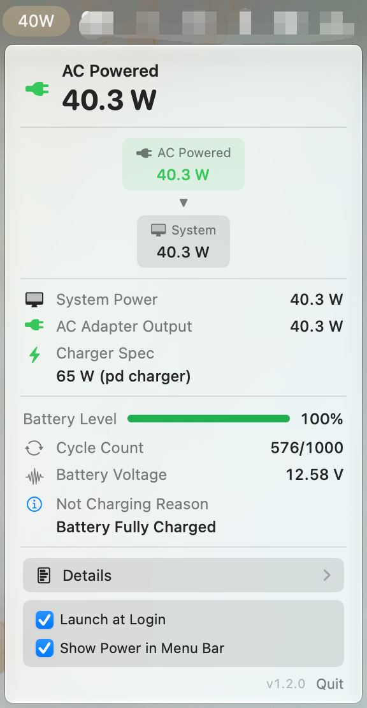
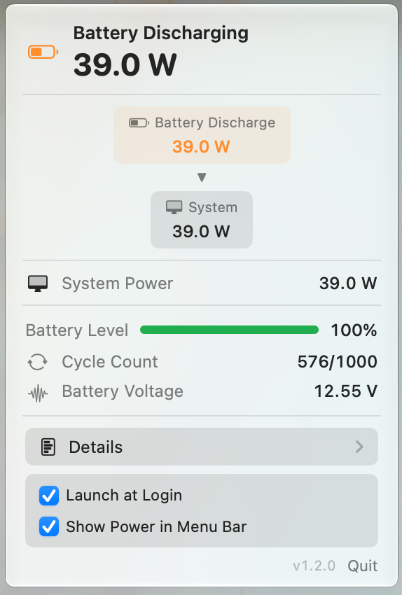
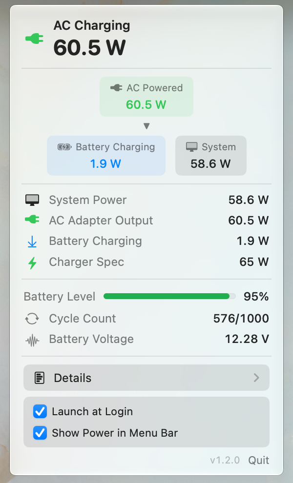
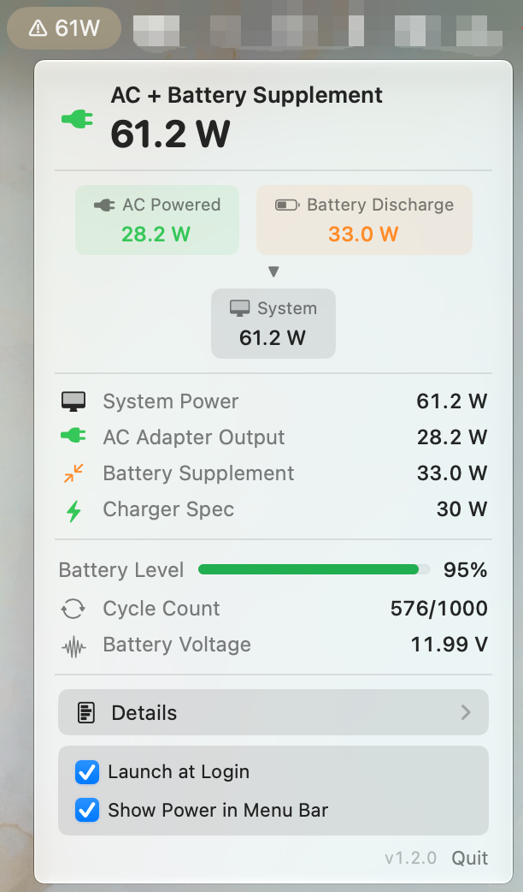
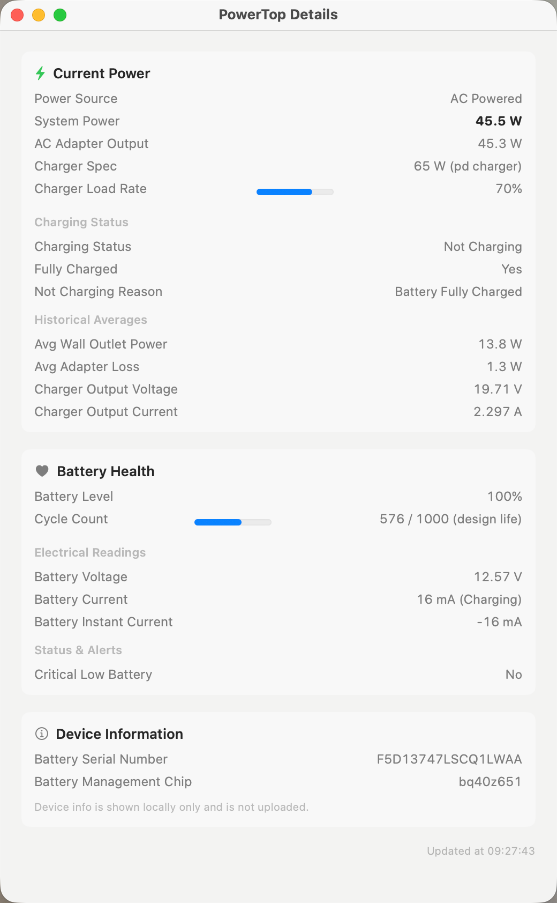

# PowerTop

**English** | **[简体中文](README.zh-CN.md)**

A clean, lightweight menu bar app that shows you exactly how much power your MacBook is using.

<p align="center">
  
  
  
  
</p>

> **MacBook only** — Requires a Mac with a built-in battery (Apple Silicon MacBook).

## Finally Know How Much Power You're Using

macOS never tells you the actual watts your MacBook is consuming right now. PowerTop changes that.

It gives you clear, real-time power information directly in the menu bar and a simple popover — so you can see exactly what's happening with power on your machine.

## Key Features

- **Optional menu bar wattage** — Show live power like `23W` right in the menu bar when you want it.
- **Power flow diagram** — See at a glance whether power is coming from the charger, the battery, or both at the same time.
- **Instant power numbers** — System power, charger output, and battery charge or discharge rate.
- **Charger load** — Know your adapter's wattage and how much of it is being used.
- **Battery overview** — Quick view of battery level, health, temperature, and cycle count.
- **Detailed information** — Open the details window to see cell voltages, charging status, lifetime stats, and more.

Everything updates live and stays accurate even when you plug in or unplug your charger.

## Why People Use PowerTop

- Curious about real power consumption on their MacBook
- Want to know if their charger is powerful enough during heavy work
- Like seeing when the battery is helping supply power
- Want a simple, beautiful way to monitor battery health and charging behavior

It's a small, native app that does one thing well — no bloat, no subscriptions.

## Installation

### Download (Recommended)

Download the latest `PowerTop.zip` from the [Releases](https://github.com/kDolphin/PowerTop/releases) page:

1. Unzip the file
2. Drag `PowerTop.app` into your `/Applications` folder
3. First launch: right-click the app → **Open** (the app is not signed)

### Build from Source

```bash
git clone https://github.com/kDolphin/PowerTop.git
cd PowerTop
bash build.sh
open build/PowerTop.app
```

## Requirements

- Apple Silicon MacBook (M-series)
- macOS 14 (Sonoma) or later

## How to Use

1. Open PowerTop — the icon appears in your menu bar.
2. Click the icon to open the popover with the power flow diagram and current readings.
3. Turn on **Show Power in Menu Bar** at the bottom if you want the wattage always visible.
4. Click **Details** for a full breakdown of power and battery information.

## Screenshots

### Popover

**AC Powered**



**Battery Discharging** (menu bar power enabled)



**AC Charging**



**AC + Battery Supplement** (battery assisting under high load)



### Detail Window



## What's New

For the latest improvements and full release notes, visit the [Releases](https://github.com/kDolphin/PowerTop/releases) page.

## License

MIT License. See [LICENSE](LICENSE) for details.
