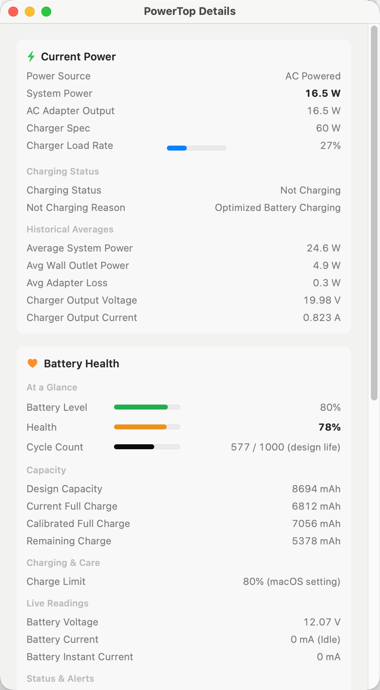
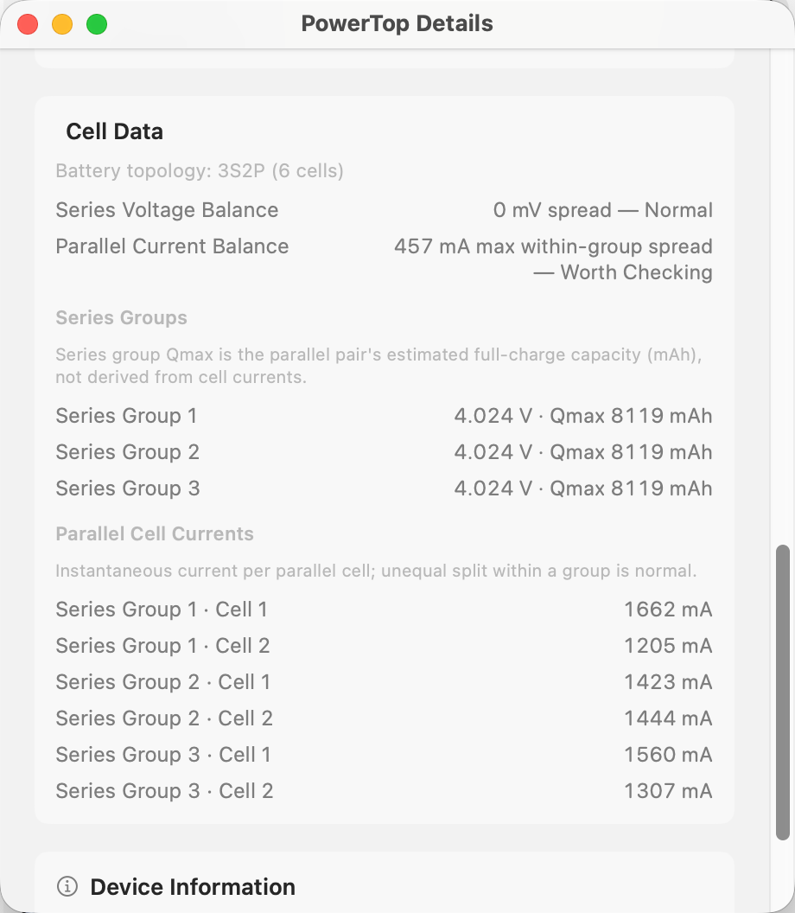

# PowerTop

**[English](README.md)** | **简体中文**

一个简洁轻量的菜单栏应用，实时显示你的 MacBook 正在消耗多少功率。

<p align="center">
  
  
  
  
</p>

> **仅支持 MacBook** — 需要配备内置电池的 Apple Silicon MacBook。

## 终于能看到 MacBook 真实的功耗了

macOS 从来不会直接告诉你「现在系统正在消耗多少瓦」。PowerTop 解决了这个问题。

它把清晰、实时的功率信息放在菜单栏和弹窗里，让你随时知道电脑的用电情况。

## 主要功能

- **菜单栏功率显示（可选）** — 需要时可在菜单栏直接看到 `23W` 这样的实时数字。
- **功率流向图** — 一目了然地看到功率是来自充电器、电池，还是两者同时提供。
- **即时功率数据** — 系统功耗、充电器输出、电池充电或放电功率。
- **充电器负载情况** — 显示你的适配器功率以及当前使用率。
- **电池概览** — 快速查看电量、健康度、温度和循环次数。
- **预估剩余时间** — 在 Popover 和详细参数中估算可用时间；支持 macOS 充电上限（80/85/90/95%）及 AlDente 等第三方工具。
- **详细参数窗口** — 自动识别电芯拓扑（如 3S2P）、串联组电压、并联节电流、充电状态与生命周期统计。

数据实时更新，即使在插拔电源的瞬间也能保持准确可靠。

## 为什么用户喜欢用它

- 想知道 MacBook 实际消耗了多少功率
- 想了解自己的充电器在高负载时是否够用
- 想看到电池什么时候在帮忙供电
- 希望有一个简单漂亮的方式查看电池健康和充电行为

它是一个小巧的原生 Mac 应用，只做好一件事 —— 没有多余功能，没有订阅。

## 安装方式

### 下载安装（推荐）

从 [Releases](https://github.com/kDolphin/PowerTop/releases) 页面下载最新的 `PowerTop.zip`：

1. 解压文件
2. 把 `PowerTop.app` 拖到「应用程序」文件夹
3. 首次启动：右键点击应用 → **打开**（应用未签名）

### 从源码构建

```bash
git clone https://github.com/kDolphin/PowerTop.git
cd PowerTop
bash build.sh
open build/PowerTop.app
```

## 系统要求

- Apple Silicon MacBook（M 系列芯片）
- macOS 14（Sonoma）或更高版本

## 使用方法

1. 打开 PowerTop，图标会出现在菜单栏。
2. 点击图标即可看到功率流向图和当前各项数据。
3. 在弹窗底部开启「菜单栏显示功率」，即可让功率数值常驻菜单栏。
4. 点击「详细参数」可查看完整的功率和电池信息。

## 截图展示

### 弹出窗口

| **AC 供电** | **电池放电** |
|-------------|---------------|
| <a href="screenshot/popover-ac-powered.png" target="_blank"></a> | <a href="screenshot/popover-battery-discharging.png" target="_blank"></a> |

| **AC 充电中** | **AC + 电池补充供电** |
|---------------|------------------------|
| <a href="screenshot/popover-ac-charging.png" target="_blank"></a> | <a href="screenshot/popover-ac-supplement.png" target="_blank"></a> |

### 详细参数窗口

| **功率与电池健康** | **电芯数据** |
|---------------------|---------------|
| <a href="screenshot/detail-window-health.png" target="_blank"></a> | <a href="screenshot/detail-window-cells.png" target="_blank"></a> |

## 更新内容

### v1.3.3

- **充电上限感知** — 预计充满时间按实际充电目标计算（macOS 设置、AlDente 或优化充电暂停点），不再一律按 100% 估算
- **更智能的上限检测** — AlDente Pro 开启「使用系统原生上限」时忽略旧配置；仅在优化充电暂停时才采用 `DailyMaxSoc`

### v1.3.2

- **电池健康修复** — 从 `BatteryData` 正确读取设计容量、满充电量与健康度；详细参数概览进度条对齐，容量命名更清晰
- **紧凑详细窗口** — 固定 460pt 宽度

### v1.3.1

- **电芯拓扑自动适配** — 从 IOKit 读取本机实际 S×P 结构（如 Air 的 2S2P、Pro 的 3S2P），不再写死某一种拓扑

### v1.3.0

- **预估剩余时间** — macOS 不再报告 `AvgTimeToEmpty` / `AvgTimeToFull` 时，根据剩余能量与平滑功耗自算放空/充满时间；Popover 与详细参数均可查看
- **电芯数据修复（Apple Silicon）** — 从 IOKit bank/cell 节点读取串联组电压/Qmax 与并联节电流，按本机实际拓扑自动适配
- **电芯均衡更清晰** — 拆分串联组电压均衡与并联节电流均衡
- **详细参数优化** — 修复重复行、制造日期移至设备信息、改进标签说明

### v1.2.0

- 详细参数窗口重设计、平铺布局、休眠唤醒后菜单栏即时刷新、0W idle 修复、电芯压差摘要

[更早版本 →](https://github.com/kDolphin/PowerTop/releases)

## 许可证

MIT 许可证。详见 [LICENSE](LICENSE)。
